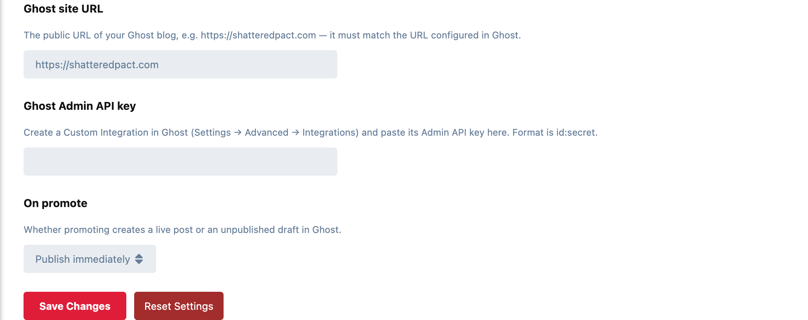

# Blog Bridge

Turn a good forum discussion into a [Ghost](https://ghost.org) blog post in
one click, without copying and pasting.



Staff get a **Promote to blog** control in a discussion's moderation menu.
Clicking it renders the opening post to HTML and creates a Ghost post through
the Ghost Admin API, with:

- **The discussion's tags** as Ghost tags. Restricted tags are left out.
- **The first image** in the post as the feature image.
- **A source line** naming the author, with a link back to the forum thread.

On the forum side:

- **Promote once, update after.** Each post is keyed to an internal `#forum-{id}` tag in Ghost, so promoting the same discussion again updates its post instead of making a duplicate. The control then reads **Update blog post**, beside **View on blog**.
- **A link to the blog post** under the discussion's title, so readers can find it. It appears as soon as the promote finishes, without a reload.
- **A confirmation step.** Promoting can publish instantly, so a confirm always stands between the click and the public post.
- **Its own permission.** **Promote discussions to the blog** can be granted to any group. Admins always have it, and the server checks it on every promote.

## Settings

Admin → Blog Bridge:

- **Ghost site URL:** your blog's public address. It must match the URL configured in Ghost.
- **Ghost Admin API key:** from a Custom Integration in Ghost (Settings → Advanced → Integrations), in the form `id:secret`.
- **On promote:** publish immediately (the default) or create a draft in Ghost.

Then, under Admin → Permissions, grant **Promote discussions to the blog** to
the staff groups that should have it.

## Good to know

- **Only the opening post is promoted.** Replies stay on the forum.
- **Unconfigured is safe.** Until the URL and key are set, promoting stops with a message saying so rather than failing quietly.

## Installation

```bash
composer require ernestdefoe/blog-bridge
php flarum migrate
php flarum cache:clear
```

Then enable **Blog Bridge** in the admin panel.

## Updating

```bash
composer update ernestdefoe/blog-bridge
php flarum migrate
php flarum cache:clear
```

## Licence

MIT.
